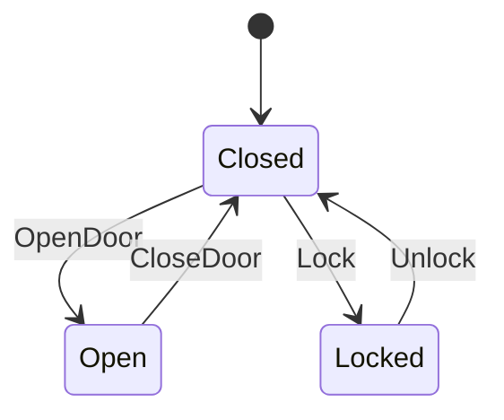

# YASM (Yet Another State Machine)

[](https://github.com/kookyleo/yasm/actions)
[](https://codecov.io/github/kookyleo/yasm)
[](https://crates.io/crates/yasm)
[](https://docs.rs/yasm)
[](https://github.com/kookyleo/yasm#license)

A simple and powerful Rust state machine library focused on usability and visualization.

## Features

- 🚀 **Easy to Use**: Define state machines with macros using clean and concise syntax
- 📊 **Visualization**: Automatically generate Mermaid format state diagrams
- 🔍 **Query Functions**: Rich state machine query and analysis capabilities
- 📝 **Documentation Generation**: Automatically generate state transition tables and documentation
- 🛡️ **Type Safety**: Leverage Rust's type system to ensure correct state transitions
- 🔧 **Hidden Operations**: Support underscore-prefixed inputs that don't appear in documentation
- 📈 **Performance Optimization**: Support history size limits to prevent memory issues

## Quick Start

### Installation and Running

```bash
# Clone the project
git clone <repository-url>
cd yasm

# Run basic demo
cargo run --example basic_demo

# Run advanced examples
cargo run --example advanced_usage

# Generate documentation
cargo run --example generate_docs
```

### Define State Machine

Use the `define_state_machine!` macro to define state machines:

```rust
use yasm::*;

mod door {
    use yasm::*;
    
    define_state_machine! {
        name: DoorStateMachine,
        states: { Closed, Open, Locked },
        inputs: { OpenDoor, CloseDoor, Lock, Unlock },
        initial: Closed,
        transitions: {
            Closed + OpenDoor => Open,
            Open + CloseDoor => Closed,
            Closed + Lock => Locked,
            Locked + Unlock => Closed
        }
    }
}
```

### Using State Machine

```rust
// Create state machine instance (default history limit: 512 entries)
let mut door = StateMachineInstance::<door::DoorStateMachine>::new();

// Create instance with custom history size limit
let mut door_limited = StateMachineInstance::<door::DoorStateMachine>::with_max_history(100);

// Check current state
println!("Current state: {:?}", door.current_state()); // Closed

// Check valid inputs
println!("Valid inputs: {:?}", door.valid_inputs()); // [OpenDoor, Lock]

// Execute state transition
door.transition(door::Input::OpenDoor).unwrap();
println!("New state: {:?}", door.current_state()); // Open

// View transition history (using efficient ring buffer)
println!("History count: {}", door.history().len());
println!("Max history size: {}", door.max_history_size()); // 512
```

### Hidden Operations (Underscore-prefixed Inputs)

Inputs starting with underscore won't appear in generated documentation but remain fully functional:

```rust
define_state_machine! {
    name: ServerStateMachine,
    states: { Active, Maintenance },
    inputs: { Maintain, Restore, _Debug, _EditDescription },
    initial: Active,
    transitions: {
        Active + Maintain => Maintenance,
        Maintenance + Restore => Active,
        // Hidden operations: won't appear in docs but query functions work normally
        Active + _Debug => Active,
        Maintenance + _Debug => Maintenance,
        Active + _EditDescription => Active,
        Maintenance + _EditDescription => Maintenance
    }
}
```

Generated documentation will only show `Maintain` and `Restore`, while `_Debug` and `_EditDescription` won't appear in state diagrams and transition tables.

### Query Functions

```rust
// Query all reachable states from a given state
let reachable = StateMachineQuery::<door::DoorStateMachine>::reachable_states(&door::State::Closed);
println!("States reachable from Closed: {:?}", reachable);

// Query all states that can reach a target state
let leading_to = StateMachineQuery::<door::DoorStateMachine>::states_leading_to(&door::State::Locked);
println!("States that can reach Locked: {:?}", leading_to);

// Check if there's a path between two states
let has_path = StateMachineQuery::<door::DoorStateMachine>::has_path(&door::State::Open, &door::State::Locked);
println!("Path from Open to Locked exists: {}", has_path);
```

### Generate Documentation

#### Mermaid State Diagram

```rust
let mermaid = StateMachineDoc::<door::DoorStateMachine>::generate_mermaid();
println!("{}", mermaid);
```

Output:


#### State Transition Table

```rust
let table = StateMachineDoc::<door::DoorStateMachine>::generate_transition_table();
println!("{}", table);
```

Output:
```markdown
# State Transition Table

| Current State | Input | Next State(s) |
|---------------|-------|---------------|
| Closed | OpenDoor | Open |
| Closed | Lock | Locked |
| Open | CloseDoor | Closed |
| Locked | Unlock | Closed |
```

## Examples

The project includes multiple examples showcasing different use cases:

### 📖 Basic Demo
```bash
cargo run --example basic_demo
```
- Door state machine and order state machine
- Basic state transitions and queries
- Documentation generation demo

### 🚀 Advanced Usage
```bash
cargo run --example advanced_usage
```
- Network connection state machine
- Game character state machine
- State machine analysis tools

### 📚 Documentation Generation
```bash
cargo run --example generate_docs
```
- Automatically generate Markdown documentation
- Output Mermaid diagram files
- Create complete project documentation

For more example details, see [examples/README.md](examples/README.md).

## Running Tests

```bash
cargo test
```

## Project Structure

```
yasm/
├── src/
│   └── lib.rs          # Core library implementation
├── examples/
│   ├── README.md       # Examples documentation
│   ├── basic_demo.rs   # Basic functionality demo
│   ├── advanced_usage.rs   # Advanced usage examples
│   └── generate_docs.rs    # Documentation generation tool
├── docs/               # Generated documentation
├── Cargo.toml
└── README.md
```

## API Documentation

### Core Traits

#### `StateMachine`
Core trait defining state machine behavior, including states, inputs, and transition logic.

#### `StateMachineInstance<SM>`
Runtime instance of a state machine that can execute transitions and record history.

Main methods:
- `new()`: Create new instance (default history limit: 512 entries)
- `with_max_history(size)`: Create instance with custom history size limit
- `current_state()`: Get current state
- `valid_inputs()`: Get valid inputs for current state
- `can_accept(input)`: Check if input is valid
- `transition(input)`: Execute state transition
- `history()`: Get transition history (ring buffer)
- `max_history_size()`: Get maximum history size

### Query Tools

#### `StateMachineQuery<SM>`
Utility class providing state machine query functionality.

Main methods:
- `reachable_states(from)`: Get all states reachable from specified state
- `states_leading_to(target)`: Get all states that can reach target state
- `has_path(from, to)`: Check if path exists between two states

### Documentation Generation

#### `StateMachineDoc<SM>`
Utility class for generating state machine documentation.

Main methods:
- `generate_mermaid()`: Generate Mermaid format state diagram
- `generate_transition_table()`: Generate Markdown format state transition table

## Design Principles

1. **MVP First**: Current version focuses on core functionality while keeping it simple and easy to use
2. **Type Safety**: Leverage Rust's type system to prevent invalid state transitions
3. **Extensible**: Design allows for future additions (non-deterministic transitions, conditional transitions, etc.)
4. **Visualization**: Built-in documentation generation for better understanding and debugging
5. **Performance Consideration**: Use ring buffer and default history limits for efficient performance

## Future Plans

- [ ] Support DSL syntax for defining state machines
- [ ] Support non-deterministic state transitions
- [ ] Support conditional transitions and guards
- [ ] Support state machine composition and nesting
- [ ] Support more output formats (GraphViz, PlantUML, etc.)
- [ ] Support state machine verification and analysis tools

## License

MIT License