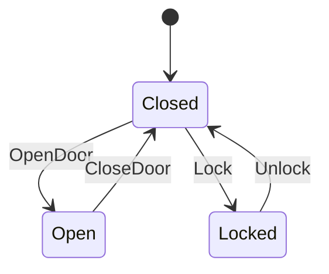

# YASM (Yet Another State Machine)

[](https://github.com/kookyleo/yasm/actions)
[](https://codecov.io/github/kookyleo/yasm)
[](https://crates.io/crates/yasm)
[](https://docs.rs/yasm)
[](https://github.com/kookyleo/yasm#license)

一个简单而强大的 Rust 状态机库，专注于易用性和可视化。

## 特性

- 🚀 **简单易用**: 通过宏定义状态机，语法简洁明了
- 📊 **可视化**: 自动生成 Mermaid 格式的状态图
- 🔍 **查询功能**: 提供丰富的状态机查询和分析功能
- 📝 **文档生成**: 自动生成状态转换表和文档
- 🛡️ **类型安全**: 利用 Rust 的类型系统确保状态转换的正确性
- 🔧 **隐藏操作**: 支持以下划线开头的隐藏输入，不会出现在文档中
- 📈 **性能优化**: 支持历史记录长度限制，避免内存溢出

## 快速开始

### 安装和运行

```bash
# 克隆项目
git clone <repository-url>
cd yasm

# 运行基础演示
cargo run --example basic_demo

# 运行高级示例
cargo run --example advanced_usage

# 生成文档
cargo run --example generate_docs
```

### 定义状态机

使用 `define_state_machine!` 宏来定义状态机：

```rust
use yasm::*;

mod door {
    use yasm::*;
    
    define_state_machine! {
        name: DoorStateMachine,
        states: { Closed, Open, Locked },
        inputs: { OpenDoor, CloseDoor, Lock, Unlock },
        initial: Closed,
        transitions: {
            Closed + OpenDoor => Open,
            Open + CloseDoor => Closed,
            Closed + Lock => Locked,
            Locked + Unlock => Closed
        }
    }
}
```

### 使用状态机

```rust
// 创建状态机实例（默认历史记录限制为 512 条）
let mut door = StateMachineInstance::<door::DoorStateMachine>::new();

// 创建带自定义历史记录长度限制的实例
let mut door_limited = StateMachineInstance::<door::DoorStateMachine>::with_max_history(100);

// 查看当前状态
println!("当前状态: {:?}", door.current_state()); // Closed

// 查看可接受的输入
println!("可接受的输入: {:?}", door.valid_inputs()); // [OpenDoor, Lock]

// 执行状态转换
door.transition(door::Input::OpenDoor).unwrap();
println!("新状态: {:?}", door.current_state()); // Open

// 查看转换历史（使用高效的环形缓冲区）
println!("历史记录数量: {}", door.history().len());
println!("最大历史记录: {}", door.max_history_size()); // 512
```

### 隐藏操作（下划线开头输入）

以下划线开头的输入操作不会出现在生成的文档中，但仍然可以正常使用：

```rust
define_state_machine! {
    name: ServerStateMachine,
    states: { Active, Maintenance },
    inputs: { Maintain, Restore, _Debug, _EditDescription },
    initial: Active,
    transitions: {
        Active + Maintain => Maintenance,
        Maintenance + Restore => Active,
        // 隐藏操作：不会在文档中显示，但查询功能还是完整的
        Active + _Debug => Active,
        Maintenance + _Debug => Maintenance,
        Active + _EditDescription => Active,
        Maintenance + _EditDescription => Maintenance
    }
}
```

生成的文档将只显示 `Maintain` 和 `Restore`，而 `_Debug` 和 `_EditDescription` 不会出现在状态图和转换表中。

### 查询功能

```rust
// 查询从某状态可达的所有状态
let reachable = StateMachineQuery::<door::DoorStateMachine>::reachable_states(&door::State::Closed);
println!("从 Closed 可达的状态: {:?}", reachable);

// 查询可以到达某状态的所有状态
let leading_to = StateMachineQuery::<door::DoorStateMachine>::states_leading_to(&door::State::Locked);
println!("可以到达 Locked 的状态: {:?}", leading_to);

// 检查两个状态之间是否有路径
let has_path = StateMachineQuery::<door::DoorStateMachine>::has_path(&door::State::Open, &door::State::Locked);
println!("Open 到 Locked 有路径: {}", has_path);
```

### 生成文档

#### Mermaid 状态图

```rust
let mermaid = StateMachineDoc::<door::DoorStateMachine>::generate_mermaid();
println!("{}", mermaid);
```

输出：


#### 状态转换表

```rust
let table = StateMachineDoc::<door::DoorStateMachine>::generate_transition_table();
println!("{}", table);
```

输出：
```markdown
# State Transition Table

| Current State | Input | Next State(s) |
|---------------|-------|---------------|
| Closed | OpenDoor | Open |
| Closed | Lock | Locked |
| Open | CloseDoor | Closed |
| Locked | Unlock | Closed |
```

## 示例

项目包含多个示例，展示不同的使用场景：

### 📖 基础演示
```bash
cargo run --example basic_demo
```
- 门状态机和订单状态机
- 基本的状态转换和查询
- 文档生成演示

### 🚀 高级用法
```bash
cargo run --example advanced_usage
```
- 网络连接状态机
- 游戏角色状态机
- 状态机分析工具

### 📚 文档生成
```bash
cargo run --example generate_docs
```

## API 文档

### 核心 Trait

#### `StateMachine`
定义状态机行为的核心 trait，包括状态、输入和转换逻辑。

#### `StateMachineInstance<SM>`
状态机的运行时实例，可以执行转换并记录历史。

主要方法：
- `new()`: 创建新实例（默认历史记录限制 512 条）
- `with_max_history(size)`: 创建带自定义历史记录长度限制的实例
- `current_state()`: 获取当前状态
- `valid_inputs()`: 获取当前状态的有效输入
- `can_accept(input)`: 检查输入是否有效
- `transition(input)`: 执行状态转换
- `history()`: 获取转换历史（环形缓冲区）
- `max_history_size()`: 获取历史记录最大长度

### 查询工具

#### `StateMachineQuery<SM>`
提供状态机查询功能的工具类。

主要方法：
- `reachable_states(from)`: 获取从指定状态可达的所有状态
- `states_leading_to(target)`: 获取可以到达目标状态的所有状态
- `has_path(from, to)`: 检查两个状态之间是否存在路径

### 文档生成

#### `StateMachineDoc<SM>`
用于生成状态机文档的工具类。

主要方法：
- `generate_mermaid()`: 生成 Mermaid 格式的状态图
- `generate_transition_table()`: 生成 Markdown 格式的状态转换表

## 设计原则

1. **MVP 优先**: 当前版本专注于核心功能，保持简单易用
2. **类型安全**: 利用 Rust 的类型系统防止无效的状态转换
3. **可扩展**: 设计允许未来添加更多功能（非确定性转换、条件转换等）
4. **可视化**: 内置文档生成功能，便于理解和调试
5. **性能考虑**: 使用环形缓冲区和默认历史限制，确保高效性能

## 项目结构

```
yasm/
├── src/
│   └── lib.rs          # 核心库实现
├── examples/
│   ├── README.md       # 示例说明文档
│   ├── basic_demo.rs   # 基础功能演示
│   ├── advanced_usage.rs   # 高级用法示例
│   └── generate_docs.rs    # 文档生成工具
├── docs/               # 生成的文档
├── Cargo.toml
└── README.md
```