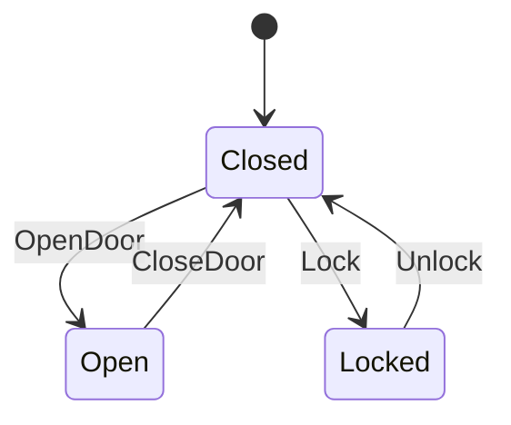

# YASM (Yet Another State Machine)

[](https://github.com/kookyleo/yasm/actions)
[](https://codecov.io/github/kookyleo/yasm)
[](https://crates.io/crates/yasm)
[](https://docs.rs/yasm)
[](https://github.com/kookyleo/yasm#license)

一个简单而强大的 Rust 状态机库，专注于易用性和可视化。

## 特性

- 🚀 **简单易用**: 通过宏定义状态机，语法简洁明了
- 📊 **可视化**: 自动生成 Mermaid 格式的状态图
- 🔍 **查询功能**: 提供丰富的状态机查询和分析功能
- 📝 **文档生成**: 自动生成状态转换表和文档
- 🛡️ **类型安全**: 利用 Rust 的类型系统确保状态转换的正确性

## 快速开始

### 安装和运行

```bash
# 克隆项目
git clone <repository-url>
cd yasm

# 运行基础演示
cargo run --example basic_demo

# 运行高级示例
cargo run --example advanced_usage

# 生成文档
cargo run --example generate_docs
```

### 定义状态机

使用 `define_state_machine!` 宏来定义状态机：

```rust
use yasm::*;

mod door {
    use yasm::*;
    
    define_state_machine! {
        name: DoorStateMachine,
        states: { Closed, Open, Locked },
        inputs: { OpenDoor, CloseDoor, Lock, Unlock },
        initial: Closed,
        transitions: {
            Closed + OpenDoor => Open,
            Open + CloseDoor => Closed,
            Closed + Lock => Locked,
            Locked + Unlock => Closed
        }
    }
}
```

### 使用状态机

```rust
// 创建状态机实例
let mut door = StateMachineInstance::<door::DoorStateMachine>::new();

// 查看当前状态
println!("当前状态: {:?}", door.current_state()); // Closed

// 查看可接受的输入
println!("可接受的输入: {:?}", door.valid_inputs()); // [OpenDoor, Lock]

// 执行状态转换
door.transition(door::Input::OpenDoor).unwrap();
println!("新状态: {:?}", door.current_state()); // Open

// 查看转换历史
println!("历史: {:?}", door.history());
```

### 查询功能

```rust
// 查询从某状态可达的所有状态
let reachable = StateMachineQuery::<door::DoorStateMachine>::reachable_states(&door::State::Closed);
println!("从 Closed 可达的状态: {:?}", reachable);

// 查询可以到达某状态的所有状态
let leading_to = StateMachineQuery::<door::DoorStateMachine>::states_leading_to(&door::State::Locked);
println!("可以到达 Locked 的状态: {:?}", leading_to);

// 检查两个状态之间是否有路径
let has_path = StateMachineQuery::<door::DoorStateMachine>::has_path(&door::State::Open, &door::State::Locked);
println!("Open 到 Locked 有路径: {}", has_path);
```

### 生成文档

#### Mermaid 状态图

```rust
let mermaid = StateMachineDoc::<door::DoorStateMachine>::generate_mermaid();
println!("{}", mermaid);
```

输出：


#### 状态转换表

```rust
let table = StateMachineDoc::<door::DoorStateMachine>::generate_transition_table();
println!("{}", table);
```

输出：
```markdown
# State Transition Table

| Current State | Input | Next State(s) |
|---------------|-------|---------------|
| Closed | OpenDoor | Open |
| Closed | Lock | Locked |
| Open | CloseDoor | Closed |
| Locked | Unlock | Closed |
```

## 示例

项目包含多个示例，展示不同的使用场景：

### 📖 基础演示
```bash
cargo run --example basic_demo
```
- 门状态机和订单状态机
- 基本的状态转换和查询
- 文档生成演示

### 🚀 高级用法
```bash
cargo run --example advanced_usage
```
- 网络连接状态机
- 游戏角色状态机
- 状态机分析工具

### 📚 文档生成
```bash
cargo run --example generate_docs
```

## 项目结构

```
yasm/
├── src/
│   └── lib.rs          # 核心库实现
├── examples/
│   ├── README.md       # 示例说明文档
│   ├── basic_demo.rs   # 基础功能演示
│   ├── advanced_usage.rs   # 高级用法示例
│   └── generate_docs.rs    # 文档生成工具
├── docs/               # 生成的文档
├── Cargo.toml
└── README.md
```