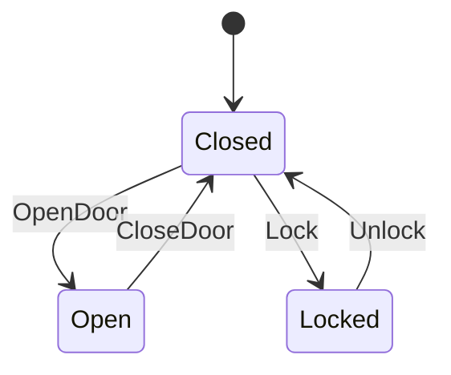

# 门状态机

这是一个简单的门状态机，演示了门的基本操作：开门、关门和锁门。

## 状态图



## 状态说明

- **Closed**: 门关闭状态，可以开门或锁门
- **Open**: 门打开状态，只能关门
- **Locked**: 门锁定状态，只能解锁

## 输入说明

- **OpenDoor**: 开门操作
- **CloseDoor**: 关门操作
- **Lock**: 锁门操作
- **Unlock**: 解锁操作

# State Transition Table

| Current State | Input | Next State(s) |
|---------------|-------|---------------|
| Closed | OpenDoor | Open |
| Closed | Lock | Locked |
| Open | CloseDoor | Closed |
| Locked | Unlock | Closed |

## 使用示例

```rust
use yasm::*;

let mut door = StateMachineInstance::<door::DoorStateMachine>::new();
assert_eq!(*door.current_state(), door::State::Closed);

// 开门
door.transition(door::Input::OpenDoor).unwrap();
assert_eq!(*door.current_state(), door::State::Open);

// 关门
door.transition(door::Input::CloseDoor).unwrap();
assert_eq!(*door.current_state(), door::State::Closed);

// 锁门
door.transition(door::Input::Lock).unwrap();
assert_eq!(*door.current_state(), door::State::Locked);
```
