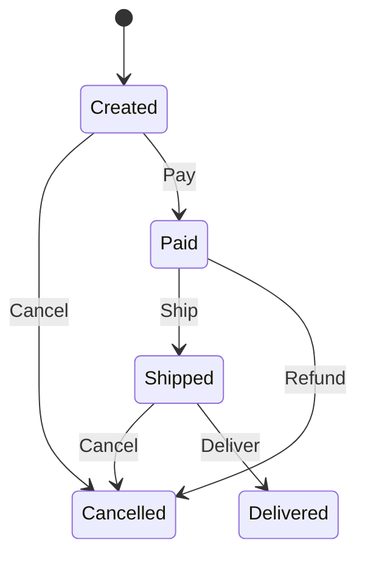

# 订单处理状态机

这是一个订单处理状态机，演示了电商订单的完整生命周期。

## 状态图



## 状态说明

- **Created**: 订单已创建，等待支付
- **Paid**: 订单已支付，等待发货
- **Shipped**: 订单已发货，在途中
- **Delivered**: 订单已送达，交易完成
- **Cancelled**: 订单已取消

## 输入说明

- **Pay**: 支付订单
- **Ship**: 发货
- **Deliver**: 确认送达
- **Cancel**: 取消订单
- **Refund**: 申请退款

# State Transition Table

| Current State | Input | Next State(s) |
|---------------|-------|---------------|
| Created | Pay | Paid |
| Created | Cancel | Cancelled |
| Paid | Ship | Shipped |
| Paid | Refund | Cancelled |
| Shipped | Deliver | Delivered |
| Shipped | Cancel | Cancelled |

## 业务流程

### 正常流程
1. 订单创建 (Created)
2. 用户支付 (Pay) → 已支付 (Paid)
3. 商家发货 (Ship) → 已发货 (Shipped)
4. 确认送达 (Deliver) → 已送达 (Delivered)

### 取消流程
- 创建后直接取消: Created → (Cancel) → Cancelled
- 支付后申请退款: Paid → (Refund) → Cancelled
- 发货后取消: Shipped → (Cancel) → Cancelled

## 使用示例

```rust
use yasm::*;

let mut order = StateMachineInstance::<order::OrderStateMachine>::new();

// 正常订单流程
order.transition(order::Input::Pay).unwrap();
order.transition(order::Input::Ship).unwrap();
order.transition(order::Input::Deliver).unwrap();
assert_eq!(*order.current_state(), order::State::Delivered);
```
