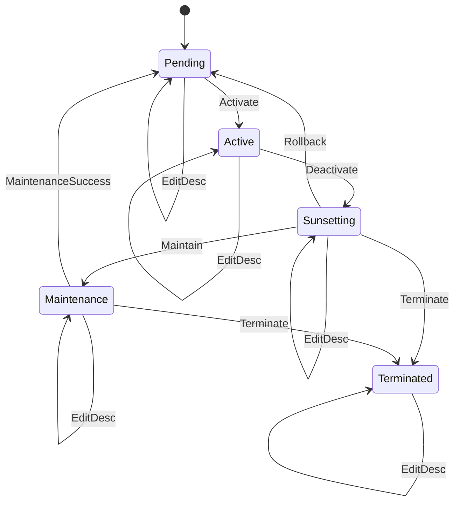

# Resource State Machine

This is a comprehensive resource state machine that manages the lifecycle of resources (such as workers, services, or infrastructure components).

## State Diagram



## State Descriptions

- **Pending**: Resource is created and waiting to be activated
- **Active**: Resource is running and serving requests
- **Sunsetting**: Resource is being phased out, no new requests accepted
- **Maintenance**: Resource is under maintenance, temporarily unavailable
- **Terminated**: Resource has been permanently shut down

## Input Descriptions

- **Activate**: Start the resource and make it available
- **Deactivate**: Begin the sunsetting process
- **Maintain**: Put the resource into maintenance mode
- **Terminate**: Permanently shut down the resource
- **EditDesc**: Add or modify notes about the resource (available in all states)
# State Transition Table

| Current State | Input | Next State(s) |
|---------------|-------|---------------|
| Pending | Activate | Active |
| Pending | EditDesc | Pending |
| Active | Deactivate | Sunsetting |
| Active | EditDesc | Active |
| Sunsetting | Maintain | Maintenance |
| Sunsetting | Terminate | Terminated |
| Sunsetting | Rollback | Pending |
| Sunsetting | EditDesc | Sunsetting |
| Maintenance | Terminate | Terminated |
| Maintenance | MaintenanceSuccess | Pending |
| Maintenance | EditDesc | Maintenance |
| Terminated | EditDesc | Terminated |

## Operational Workflows

### Normal Lifecycle
1. Resource created (Pending)
2. Resource activated (Activate) → Active
3. Resource deactivated (Deactivate) → Sunsetting
4. Final termination (Terminate) → Terminated

### Maintenance Workflow
- From Sunsetting: (Maintain) → Maintenance
- From Maintenance: (Restore) → Pending
- From Maintenance: (Terminate) → Terminated

### Monitoring Operations
- EditDesc and ViewLogs operations are available in all states
- These operations don't change the resource state
- Useful for operational monitoring and documentation

## Usage Example

```rust
use yasm::*;

let mut resource = StateMachineInstance::<workers::ResourceStateMachine>::new();
assert_eq!(*resource.current_state(), workers::State::Pending);

// Activate resource
resource.transition(workers::Input::Activate).unwrap();
assert_eq!(*resource.current_state(), workers::State::Active);

// Add notes while active
resource.transition(workers::Input::EditDesc).unwrap();
assert_eq!(*resource.current_state(), workers::State::Active);

// Begin sunsetting
resource.transition(workers::Input::Deactivate).unwrap();
assert_eq!(*resource.current_state(), workers::State::Sunsetting);

// Enter maintenance mode
resource.transition(workers::Input::Maintain).unwrap();
assert_eq!(*resource.current_state(), workers::State::Maintenance);

// Restore to pending
resource.transition(workers::Input::Restore).unwrap();
assert_eq!(*resource.current_state(), workers::State::Pending);
```
