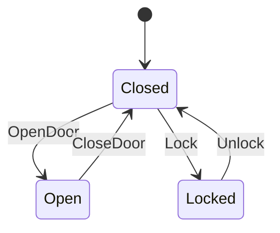

# Door State Machine

This is a simple door state machine that demonstrates basic door operations: opening, closing, and locking.

## State Diagram



## State Descriptions

- **Closed**: Door is closed, can be opened or locked
- **Open**: Door is open, can only be closed
- **Locked**: Door is locked, can only be unlocked

## Input Descriptions

- **OpenDoor**: Open door operation
- **CloseDoor**: Close door operation
- **Lock**: Lock door operation
- **Unlock**: Unlock door operation

# State Transition Table

| Current State | Input | Next State(s) |
|---------------|-------|---------------|
| Closed | OpenDoor | Open |
| Closed | Lock | Locked |
| Open | CloseDoor | Closed |
| Locked | Unlock | Closed |

## Usage Example

```rust
use yasm::*;

let mut door = StateMachineInstance::<door::DoorStateMachine>::new();
assert_eq!(*door.current_state(), door::State::Closed);

// Open door
door.transition(door::Input::OpenDoor).unwrap();
assert_eq!(*door.current_state(), door::State::Open);

// Close door
door.transition(door::Input::CloseDoor).unwrap();
assert_eq!(*door.current_state(), door::State::Closed);

// Lock door
door.transition(door::Input::Lock).unwrap();
assert_eq!(*door.current_state(), door::State::Locked);
```
