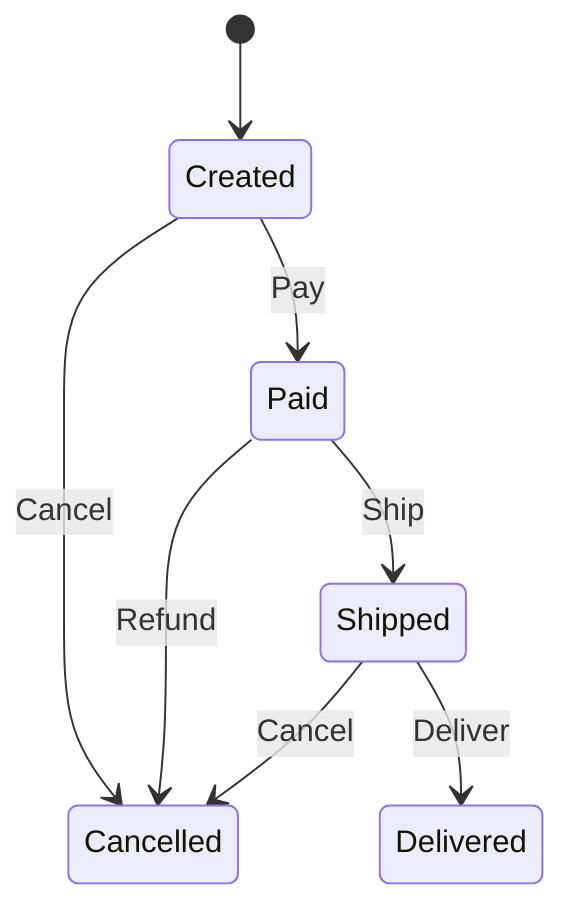

# Order Processing State Machine

This is an order processing state machine that demonstrates the complete lifecycle of an e-commerce order.

## State Diagram



## State Descriptions

- **Created**: Order has been created, waiting for payment
- **Paid**: Order has been paid, waiting for shipment
- **Shipped**: Order has been shipped, in transit
- **Delivered**: Order has been delivered, transaction complete
- **Cancelled**: Order has been cancelled

## Input Descriptions

- **Pay**: Pay for the order
- **Ship**: Ship the order
- **Deliver**: Confirm delivery
- **Cancel**: Cancel the order
- **Refund**: Request a refund

# State Transition Table

| Current State | Input | Next State(s) |
|---------------|-------|---------------|
| Created | Pay | Paid |
| Created | Cancel | Cancelled |
| Paid | Ship | Shipped |
| Paid | Refund | Cancelled |
| Shipped | Deliver | Delivered |
| Shipped | Cancel | Cancelled |

## Business Processes

### Normal Flow
1. Order created (Created)
2. User pays (Pay) → Paid
3. Merchant ships (Ship) → Shipped
4. Delivery confirmed (Deliver) → Delivered

### Cancellation Flow
- Direct cancellation after creation: Created → (Cancel) → Cancelled
- Refund after payment: Paid → (Refund) → Cancelled
- Cancellation after shipping: Shipped → (Cancel) → Cancelled

## Usage Example

```rust
use yasm::*;

let mut order = StateMachineInstance::<order::OrderStateMachine>::new();

// Normal order flow
order.transition(order::Input::Pay).unwrap();
order.transition(order::Input::Ship).unwrap();
order.transition(order::Input::Deliver).unwrap();
assert_eq!(*order.current_state(), order::State::Delivered);
```
