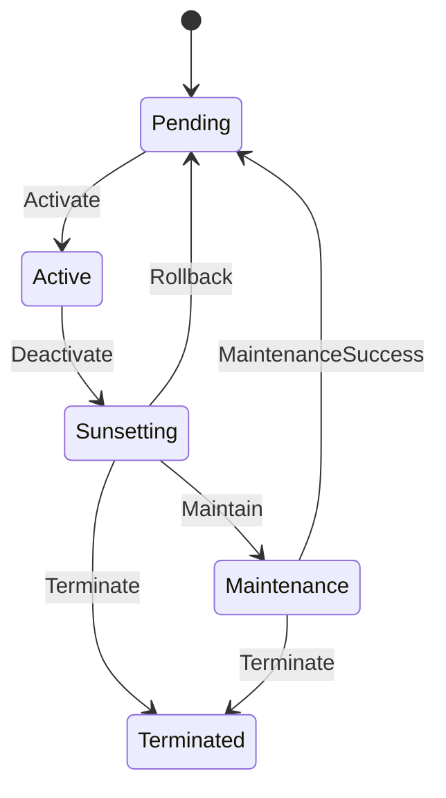

# Server State Machine

This is a comprehensive server state machine that manages the lifecycle of servers (such as workers, services, or infrastructure components).

## State Diagram



## State Descriptions

- **Pending**: Server is created and waiting to be activated
- **Active**: Server is running and serving requests
- **Sunsetting**: Server is being phased out, no new requests accepted
- **Maintenance**: Server is under maintenance, temporarily unavailable
- **Terminated**: Server has been permanently shut down

## Input Descriptions

- **Activate**: Start the resource and make it available
- **Deactivate**: Begin the sunsetting process
- **Maintain**: Put the resource into maintenance mode
- **Terminate**: Permanently shut down the resource
- **EditDesc**: Add or modify notes about the resource (available in all states)
# State Transition Table

| Current State | Input | Next State |
|---------------|-------|------------|
| Pending | Activate | Active |
| Active | Deactivate | Sunsetting |
| Sunsetting | Maintain | Maintenance |
| Sunsetting | Terminate | Terminated |
| Sunsetting | Rollback | Pending |
| Maintenance | Terminate | Terminated |
| Maintenance | MaintenanceSuccess | Pending |

## Operational Workflows

### Normal Lifecycle
1. Server created (Pending)
2. Server activated (Activate) → Active
3. Server deactivated (Deactivate) → Sunsetting
4. Server maintenance (Maintain) → Maintenance
5. Server terminated (Terminate) → Terminated

### Maintenance Workflow
- From Sunsetting: (Maintain) → Maintenance
- From Maintenance: (Terminate) → Terminated

### Monitoring Operations
- EditDesc operations are available in all states
- These operations don't change the server state
- Useful for operational monitoring and documentation

## Usage Example

```rust
use yasm::*;

let mut server = StateMachineInstance::<server::ServerStateMachine>::new();
assert_eq!(*server.current_state(), server::State::Pending);

// Activate server
server.transition(server::Input::Activate).unwrap();
assert_eq!(*server.current_state(), server::State::Active);

// Add notes while active
server.transition(server::Input::EditDesc).unwrap();
assert_eq!(*server.current_state(), server::State::Active);

// Begin sunsetting
server.transition(server::Input::Deactivate).unwrap();
assert_eq!(*server.current_state(), server::State::Sunsetting);

// Enter maintenance mode
server.transition(server::Input::Maintain).unwrap();
assert_eq!(*server.current_state(), server::State::Maintenance);

// Maintenance successful
server.transition(server::Input::MaintenanceSuccess).unwrap();
assert_eq!(*server.current_state(), server::State::Pending);
```
